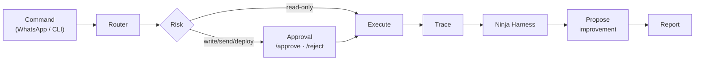

# agent-os

**A self-improving agent platform that uses [Ninja Harness](https://github.com/gagans23/ninja-harness) as its evaluation gate.**

agent-os is the *runtime* layer — command routing, agent profiles, persistent
memory, a reusable skill library, full trace recording, and a propose-only
self-improvement loop. Ninja Harness is the *evaluation/certification* layer it
calls. Keeping them separate is deliberate: one runs agents, the other grades them.



📐 **Full diagrams & module map:** [docs/architecture.md](docs/architecture.md)

> Status: **v0.3 — all three levels shipped.** Core + Reliability + Controlled
> Autonomy are working and tested. Live integrations (WhatsApp/Meta, Gmail,
> Cloudflare Tunnel, GitHub publish) are pluggable adapters you wire with your
> own credentials — none are bundled or faked.

## Install

Requires Python 3.11+ and a local Ninja Harness checkout (until it's on PyPI):

```bash
pip install -e ../ninja-harness    # the eval gate
pip install -e ".[dev]"            # agent-os
```

## Try the loop (no external services)

```bash
python examples/demo_run.py
# or
agent-os run "research the top Hacker News stories" --profile researcher
```

Example output:

```
Job complete.

Result: PASS
Ninja score: 94.3
Safety: PASS
Artifact: traces/<job_id>/final.md
```

## The three core modules

| Module | Responsibility |
|---|---|
| `trace_recorder.py` | Record every job into `traces/<job_id>/` (command, stdout, screenshots, final, trace.json, ninja_report.json). Produces a Ninja-Harness-parseable trace. |
| `agent_memory.py` | Persistent memory: `MEMORY.md`, `USER.md`, `state.db` (facts, prefs, outcomes), `sessions/`. |
| `skill_registry.py` | Load reusable procedures from `skills/*/SKILL.md` (triggers, procedure, pitfalls, verification, artifacts) and match a command to the best skill. |

Plus: `profiles.py` (researcher / operator / builder / qa), `improvement.py`
(propose-only patches), and `runner.py` (the loop).

## Agent profiles

Each profile has its own allowed tools, memory namespace, personality, and a
quality threshold for the eval gate:

- **researcher** — browser + summarization (threshold 85)
- **operator** — Gmail, WhatsApp, status checks (threshold 90; touches secrets)
- **builder** — code changes, GitHub, deployments (threshold 85)
- **qa** — Ninja Harness, regression, red-team (threshold 80)

## Self-improvement (propose-only)

After a weak run (`NARI < profile threshold`), `propose_improvement()` builds a
structured proposal — failure reason, suggested memory update, suggested skill
patch — that **requires explicit human approval**. The agent never rewrites
itself automatically.

## Command surface (Level 1)

The platform exposes a transport-agnostic command router — the same commands you'll
wire to WhatsApp later. Try them locally with `agent-os cmd`:

```bash
agent-os cmd "/ping"            # liveness
agent-os cmd "/status"          # health + recent jobs
agent-os cmd "/agents"          # list agent profiles
agent-os cmd "/skills"          # list skills + triggers
agent-os cmd "/eval"            # run the Ninja Harness suite (or summarize jobs)
agent-os cmd "/browser-demo"    # run the demo agent end-to-end
agent-os cmd "/job f6df6f7d"    # show a persisted job (id or short prefix)
agent-os cmd "/trace f6df6f7d"  # show a job's trajectory + score
```

Every run is persisted to **SQLite** (`agent_state/jobs.db`), so jobs survive
restarts and you can look them up by id (or short suffix) afterward. Each major
run leaves behind a **trace**, a **Ninja Harness score**, and (if weak) an
**improvement proposal** — that's how the system compounds.

## CLI

```bash
agent-os run "<command>" [--profile P] [--agent-cmd "python my_agent.py"] [--case case.yaml] [--json]
agent-os cmd "/status"          # WhatsApp-style command surface
agent-os skills                 # list skills + triggers
agent-os memory                 # recent job outcomes
```

`agent-os run` (and `cmd` for write actions) exit non-zero when a run is flagged,
so they work as a CI gate.

## Roadmap (three levels)

**Level 1 — Agent OS Core** ✅ *(this release)*
SQLite persistent jobs · trace recorder · skill registry · agent profiles ·
command router (`/eval /skills /agents /job /trace /status /ping /browser-demo`) ·
Ninja Harness report after every run.

**Level 2 — Reliability Layer** ✅ *(this release)*
Bridge process supervisor (`supervisor.py`, restart + backoff) · health checks
(`health.py`, `/health`) · structured JSON logs (`logging_setup.py`) · retries +
timeout policy (`reliability.py`) · token health without leaking secrets
(`token_health.py`) · sender allowlist, fail-closed (`allowlist.py`) · daily eval
summary (`daily_eval.py`). Deploy templates for the permanent Cloudflare named
tunnel, systemd/launchd supervisor service, and daily-eval schedule are in
[`deploy/`](deploy/) — you run those with your own accounts.

```bash
agent-os health                         # detailed health checks
agent-os supervise -- python bridge.py  # keep your bridge alive
agent-os daily-eval                      # daily reliability summary
```

**Level 3 — Controlled Autonomy** ✅ *(this release)*
Risk classifier (`risk.py`) · approval queue (`approvals.py`, `/pending`
`/approve` `/reject`) · read-only tasks auto-run, write/send/deploy gated ·
github-publish + gmail-digest skills. The agent never takes a privileged action
without explicit human approval.

```bash
agent-os cmd "/run summarize the inbox"   # READ_ONLY → auto-runs
agent-os cmd "/run send the weekly update" # SEND → queued for approval
agent-os cmd "/pending"                     # list what's waiting
agent-os cmd "/approve <id>"                # execute it
agent-os cmd "/reject <id>"                 # cancel it
```

> Live integrations (WhatsApp/Meta, Gmail, Cloudflare) are pluggable adapters you
> wire with your own credentials — none are bundled or faked.

## License

Apache-2.0.
