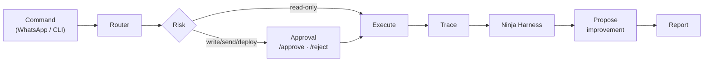

# agent-os

**A self-improving agent platform that uses [Ninja Harness](https://github.com/gagans23/ninja-harness) as its evaluation gate.**

🌐 **Website / docs:** **[gagans23.github.io/agent-os](https://gagans23.github.io/agent-os/)**

agent-os is the *runtime* layer — command routing, agent profiles, persistent
memory, a reusable skill library, full trace recording, and a propose-only
self-improvement loop. Ninja Harness is the *evaluation/certification* layer it
calls. Keeping them separate is deliberate: one runs agents, the other grades them.



📐 **Full diagrams & module map:** [docs/architecture.md](docs/architecture.md) ·
🗺️ **Modular roadmap (toward a personal agent OS):** [docs/roadmap.md](docs/roadmap.md)

> Status: **v0.11 — the governed swarm 🐝 + hardware model advisor 🩺**, on top of
> Agent Skills compatibility, a one-command install + local web UI 🖥️, model
> onboarding (Ollama/OpenAI/Claude), the Brain 🧠, and a tamper-evident governance
> spine. The three levels (Core · Reliability · Controlled Autonomy) work and are
> tested. Live integrations (WhatsApp/Meta, Gmail, Cloudflare Tunnel, GitHub
> publish) are pluggable adapters you wire with your own credentials — none bundled
> or faked.

### What agent-os is (and isn't)

agent-os is the **orchestration + evaluation + controlled-autonomy + personal-brain
spine** for your own agents. Its job isn't to be the biggest pile of connectors or
the flashiest chat UI — it's to make every agent action **traced → scored by
[Ninja Harness](https://github.com/gagans23/ninja-harness) → risk-gated → improved**,
running **local-first** (SQLite + stdlib) so a non-technical person can run it and
heavier tools can be plugged in behind the same governed spine.

## Install

**One command** (creates a local `.venv`, installs the eval gate + agent-os, no sudo):

```bash
curl -fsSL https://raw.githubusercontent.com/gagans23/agent-os/main/install.sh | bash
# or, from a clone:  ./install.sh
```

<details><summary>Manual install (Python 3.11+)</summary>

```bash
pip install "ninja-harness @ git+https://github.com/gagans23/ninja-harness.git"  # eval gate
pip install -e ".[dev]"                                                          # agent-os
```
</details>

## Run it: the web UI 🖥️ ("click a button")

**No terminal?** Double-click the launcher for your system in **`launchers/`**
(macOS `agent-os.app` · Windows `agent-os-windows.bat` · Linux `agent-os-linux.sh`).
It sets up a local environment on first run, then opens the UI in your browser —
you type nothing. (On macOS use `agent-os.app`; a bare `.command` often does
nothing on double-click because of a missing file association.) Full walkthrough
(incl. the one-click model setup): **[docs/no-terminal.md](docs/no-terminal.md)**.

Prefer the terminal?

```bash
agent-os setup       # guided steps to a working local model (prints commands; changes nothing)
agent-os setup --run # also pulls the model + remembers your choice (never installs Ollama for you)
agent-os ui          # opens http://127.0.0.1:8765 (auto-picks a free port if busy)
```

A single local page (stdlib server — nothing extra to install, **localhost-only**)
to teach the brain, ask it questions, run tasks, swarm a goal, and approve actions —
driving the **same governed command router** as the CLI, so every action is still
traced, scored, audited, and risk-gated. The startup prints the exact URL; if the
port is taken it falls back to the next free one. 📐
[docs/install-and-ui.md](docs/install-and-ui.md)

> **No-terminal model setup.** The first time you open the UI with no model
> configured, it shows a setup card with a **"Pull recommended model"** button —
> one click detects Ollama, pulls the right model for your machine, remembers the
> choice, and reloads smart. No commands to type. (It never installs Ollama itself
> — if it's missing, the card links the normal app installer. Same flow on the CLI:
> `agent-os setup --run`.)

> **`agent-os setup`** is the one-stop guided flow: it detects your machine, tells you
> the exact steps to a working local model, and with `--run` pulls the model and
> remembers your choice in `~/.agent-os/config.json` (no shell-profile editing). It
> never installs Ollama for you — that stays an explicit command you run, per
> default-deny. The UI shows the same steps as a first-time empty-state when no model
> is configured. (`agent-os doctor` / `/doctor` give just the hardware → model advice.)

## Try the loop (no external services)

```bash
python examples/demo_run.py
# or
agent-os run "research the top Hacker News stories" --profile researcher
```

Example output:

```
Job complete.

Result: PASS
Ninja score: 94.3
Safety: PASS
Artifact: traces/<job_id>/final.md
```

## The Brain 🧠 — your own context (v0.6)

The keystone of the personal-OS vision: agents that are **self-aware of *your*
context**. `context.py` is a local-first, dependency-light knowledge base —
SQLite + BM25-lite retrieval, standard library only, **zero infrastructure**.
Semantic search is a *pluggable embedder* you supply (Ollama/OpenAI/etc.) — never
bundled, never a hidden network call.

```bash
# Ahaan's maths brain: teach it, then ask — grounded in his own notes.
agent-os cmd "/learn ~/ahaan_maths_notes.md"        # ingest a file
agent-os cmd "/learn To add fractions with the same denominator, add the numerators."
agent-os cmd "/ask how do I add fractions?"
```

```
Based on your notes:
[source: note] To add fractions with the same denominator, add the numerators...

[PASS · grounding 0.75 · Job a1b2c3d4]
```

`/ask` retrieves the top chunks, answers **only from your context**, and hands
those chunks to **Ninja Harness as grounding references** — so the answer is
*scored against the source*, and ungrounded answers get flagged. Upload notes,
files, or whole folders; it becomes the brain every agent retrieves from.

```python
from agent_os.context import ContextStore
ctx = ContextStore()                       # or ContextStore(embedder=my_embedder)
ctx.ingest_file("ahaan_maths_notes.md")
print(ctx.build_context("how do I add fractions?"))   # → grounded, source-tagged
```

Run the keystone demo, and read the deep dive:

```bash
python examples/ahaan_maths_demo.py        # ingest notes → grounded, scored answers
```

📐 **Deep dive (chunking, BM25-lite, hybrid semantic search, the grounding/scoring
loop, the graph roadmap):** [docs/brain.md](docs/brain.md)

## Plug in your model 🧩 — Ollama / OpenAI / Claude (v0.7)

agent-os ships **no model and no keys**. You plug in your own with **one
environment variable** — and it stays **Ollama-first** so a non-technical user
runs everything **locally, for free, with no account**:

```bash
export AGENT_OS_PROVIDER="ollama:llama3"                       # local + free, no key
export AGENT_OS_PROVIDER="openai:gpt-4o-mini"                  # needs OPENAI_API_KEY
export AGENT_OS_PROVIDER="anthropic:claude-3-5-sonnet-20241022" # needs ANTHROPIC_API_KEY
agent-os cmd "/model"                                          # show what's wired
```

One small adapter (`providers.py`, **standard-library HTTP — no SDK**) powers three
roles at once: **reasoner** (the `/ask` answer, the `/digest` prose), **embedder**
(semantic search in the Brain — `/ask` becomes hybrid keyword + meaning), and the
**agent_fn** behind `/run`. Any OpenAI-compatible endpoint (Together, vLLM, LM
Studio, Replit's proxy) works via `openai:<model>` + `OPENAI_BASE_URL`.

With **nothing configured**, agent-os stays in **deterministic mode and makes no
model calls** — every external call is opt-in and uses *your* credentials. No
bundled keys, no hidden network calls.

```python
from agent_os.providers import get_provider, provider_from_env
p = get_provider("ollama:llama3")          # or provider_from_env() to read the env
answer = p.complete("Explain adding fractions to a 10-year-old.")
vectors = p.embed(["add fractions", "multiply fractions"])
```

```bash
python examples/provider_demo.py           # offline walkthrough of all three roles
```

📐 **Deep dive (the three roles, every provider, OpenAI-compatible endpoints, the
opt-in wiring):** [docs/providers.md](docs/providers.md)

## Skills 🧩 — incl. the open SKILL.md standard

Skills are reusable `SKILL.md` procedures the agent matches and follows. agent-os
speaks both its own format **and** the open [Agent Skills](https://agentskills.io)
standard (YAML-frontmatter `SKILL.md`), so you can point it at any folder of open
skills and import them with no code:

```bash
export AGENT_OS_SKILLS_PATH="/path/to/any/skills/dir"   # recursive, multi-root
agent-os cmd "/skills"                                   # your skills + imported ones
```

A matched skill is injected into the prompt sent to **your** model — set
`AGENT_OS_PROVIDER=ollama:llama3` to run it locally and free. **Nothing is
hardwired to one vendor**, and privileged tasks still pass the risk gate, the audit
log, and the Ninja Harness score. 📐 [docs/skills.md](docs/skills.md)

## The governed swarm 🐝 — parallel, but verified (v0.10)

One goal → a coordinator **decomposes** it → sub-tasks run **in parallel** → the
coordinator **synthesizes** one deliverable. The parallel-swarm pattern, but placed
*under* agent-os's trust spine — because speed without verification just produces
scaled-up errors, not scaled-up value.

```bash
export AGENT_OS_PROVIDER=ollama:llama3      # local + free; your model, your data
agent-os swarm "research the top 5 local LLM runtimes; for each: license, RAM, speed; compare in a table"
# or:  agent-os cmd "/swarm ..."   ·   or the 🐝 card in `agent-os ui`
```

```
🐝 Swarm: ...
   3 sub-task(s) · 2 done · 1 gated · 0 failed
   - [PASS 89] summarize the intro
   - [GATED:WRITE] delete the prod database     ← default-deny: never auto-run
Synthesis scored 88.8 (Job 2-14f5f9)
```

Every sub-task is a **real job** (traced, risk-gated, Ninja-scored, queryable via
`/job`/`/trace`); privileged sub-tasks are **gated**, not auto-executed; the
synthesis is scored too. **Local-first, your model, honest concurrency** (a
bounded pool sized to your machine — no fictional "300"). 📐
[docs/orchestrator.md](docs/orchestrator.md)

## Trust & Governance — tamper-evident by default (v0.6)

Every command is recorded into a **hash-chained, tamper-evident audit log**
(`audit.py`): each entry's hash covers its content *plus the previous hash*, so any
edit or deletion breaks the chain and is detectable. The risk classifier
(`risk.py`) is **default-deny** — anything ambiguous, or that writes/sends/deploys,
is gated for approval — and **tool-aware**, so a task is escalated if the agent
merely *can* send or delete. A global error boundary means users never see a raw
stack trace.

```bash
agent-os cmd "/audit"                       # recent entries + chain integrity
agent-os cmd "/risk make the prod table empty"   # → WRITE → REQUIRES APPROVAL
```

```
Audit log — 12 entries · chain ✅ intact
```

Every run is also **metered** — latency, estimated tokens, and estimated cost
(`$0` on local models). `/cost` rolls it up, so a run is quality- *and* cost- *and*
safety-accounted.

```bash
agent-os cmd "/cost"   # tokens · latency · est. cost across recent runs
```

See [SECURITY.md](SECURITY.md) for the full threat model and known limitations.

## Cross-episode insights (v0.4)

`insights.py` turns per-source summaries into structured **insights** — each a
claim, its evidence (every point cites a source), an implication for a chosen
lens, and a **delta vs the previous run** (the part that compounds, via memory):

```bash
python examples/podcast_digest_demo.py
```

```
Cross-episode insights
1) Shared theme: 'incentives'
- Claim/theme: Acquired and Huberman Lab both touch on 'incentives'.
- Evidence: Acquired: ... aligning incentives with investors; Huberman Lab: ...
- Delta vs previous: New theme vs previous digest.

[Ninja Harness] grounding=… hygiene=… cert=…
```

You supply the LLM `reasoner=` (for the rich prose) and your feed fetcher (to
build `EpisodeSummary` objects). A deterministic keyword fallback ships so the
loop runs and is testable without a model — and the digest is **scored by Ninja
Harness** (grounding = claims backed by evidence; hygiene = concise), so weak
synthesis gets flagged.

Run it from the command surface, plug in your model, or watch it compound:

```bash
agent-os cmd "/digest"                       # synthesize → score → persist as a job
python examples/multiday_digest_demo.py      # New → Reinforced deltas across days
```

```python
from agent_os.reasoners import LLMReasoner
from agent_os.insights import CrossEpisodeSynthesizer
synth = CrossEpisodeSynthesizer(reasoner=LLMReasoner(complete=my_model), memory=mem)
```

📐 **Deep dive (philosophy, schema, grounding, the compounding loop, the LLM
prompt contract):** [docs/insights.md](docs/insights.md) ·
skill: [`podcast-digest`](skills/podcast-digest/SKILL.md).

## The three core modules

| Module | Responsibility |
|---|---|
| `trace_recorder.py` | Record every job into `traces/<job_id>/` (command, stdout, screenshots, final, trace.json, ninja_report.json). Produces a Ninja-Harness-parseable trace. |
| `agent_memory.py` | Persistent memory: `MEMORY.md`, `USER.md`, `state.db` (facts, prefs, outcomes), `sessions/`. |
| `skill_registry.py` | Load reusable procedures from `skills/*/SKILL.md` (triggers, procedure, pitfalls, verification, artifacts) and match a command to the best skill. |

Plus: `profiles.py` (researcher / operator / builder / qa), `improvement.py`
(propose-only patches), and `runner.py` (the loop).

## Agent profiles

Each profile has its own allowed tools, memory namespace, personality, and a
quality threshold for the eval gate:

- **researcher** — browser + summarization (threshold 85)
- **operator** — Gmail, WhatsApp, status checks (threshold 90; touches secrets)
- **builder** — code changes, GitHub, deployments (threshold 85)
- **qa** — Ninja Harness, regression, red-team (threshold 80)

## Self-improvement (propose-only)

After a weak run (`NARI < profile threshold`), `propose_improvement()` builds a
structured proposal — failure reason, suggested memory update, suggested skill
patch — that **requires explicit human approval**. The agent never rewrites
itself automatically.

## Command surface (Level 1)

The platform exposes a transport-agnostic command router — the same commands you'll
wire to WhatsApp later. Try them locally with `agent-os cmd`:

```bash
agent-os cmd "/ping"            # liveness
agent-os cmd "/status"          # health + recent jobs
agent-os cmd "/agents"          # list agent profiles
agent-os cmd "/skills"          # list skills + triggers
agent-os cmd "/eval"            # run the Ninja Harness suite (or summarize jobs)
agent-os cmd "/browser-demo"    # run the demo agent end-to-end
agent-os cmd "/learn <path|text>" # ingest notes/files into the brain
agent-os cmd "/ask <question>"  # answer from your knowledge base (grounded + scored)
agent-os cmd "/audit"           # recent audit entries + chain integrity
agent-os cmd "/model"           # show the configured model provider
agent-os cmd "/job f6df6f7d"    # show a persisted job (id or short prefix)
agent-os cmd "/trace f6df6f7d"  # show a job's trajectory + score
```

Every run is persisted to **SQLite** (`agent_state/jobs.db`), so jobs survive
restarts and you can look them up by id (or short suffix) afterward. Each major
run leaves behind a **trace**, a **Ninja Harness score**, and (if weak) an
**improvement proposal** — that's how the system compounds.

## CLI

```bash
agent-os run "<command>" [--profile P] [--agent-cmd "python my_agent.py"] [--case case.yaml] [--json]
agent-os cmd "/status"          # WhatsApp-style command surface
agent-os skills                 # list skills + triggers
agent-os memory                 # recent job outcomes
```

`agent-os run` (and `cmd` for write actions) exit non-zero when a run is flagged,
so they work as a CI gate.

## Roadmap (three levels)

**Level 1 — Agent OS Core** ✅ *(this release)*
SQLite persistent jobs · trace recorder · skill registry · agent profiles ·
command router (`/eval /skills /agents /job /trace /status /ping /browser-demo`) ·
Ninja Harness report after every run.

**Level 2 — Reliability Layer** ✅ *(this release)*
Bridge process supervisor (`supervisor.py`, restart + backoff) · health checks
(`health.py`, `/health`) · structured JSON logs (`logging_setup.py`) · retries +
timeout policy (`reliability.py`) · token health without leaking secrets
(`token_health.py`) · sender allowlist, fail-closed (`allowlist.py`) · daily eval
summary (`daily_eval.py`). Deploy templates for the permanent Cloudflare named
tunnel, systemd/launchd supervisor service, and daily-eval schedule are in
[`deploy/`](deploy/) — you run those with your own accounts.

```bash
agent-os health                         # detailed health checks
agent-os supervise -- python bridge.py  # keep your bridge alive
agent-os daily-eval                      # daily reliability summary
```

**Level 3 — Controlled Autonomy** ✅ *(this release)*
Risk classifier (`risk.py`) · approval queue (`approvals.py`, `/pending`
`/approve` `/reject`) · read-only tasks auto-run, write/send/deploy gated ·
github-publish + gmail-digest skills. The agent never takes a privileged action
without explicit human approval.

```bash
agent-os cmd "/run summarize the inbox"   # READ_ONLY → auto-runs
agent-os cmd "/run send the weekly update" # SEND → queued for approval
agent-os cmd "/pending"                     # list what's waiting
agent-os cmd "/approve <id>"                # execute it
agent-os cmd "/reject <id>"                 # cancel it
```

> Live integrations (WhatsApp/Meta, Gmail, Cloudflare) are pluggable adapters you
> wire with your own credentials — none are bundled or faked.

## Contributing

PRs welcome. See **[CONTRIBUTING.md](CONTRIBUTING.md)** for setup and the workflow,
and **[docs/code-review.md](docs/code-review.md)** for how we review — small
self-contained changes, tests in the same change, and descriptions that say *what*
and *why*.

## License

Apache-2.0.
