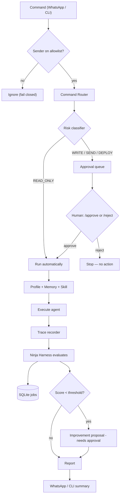
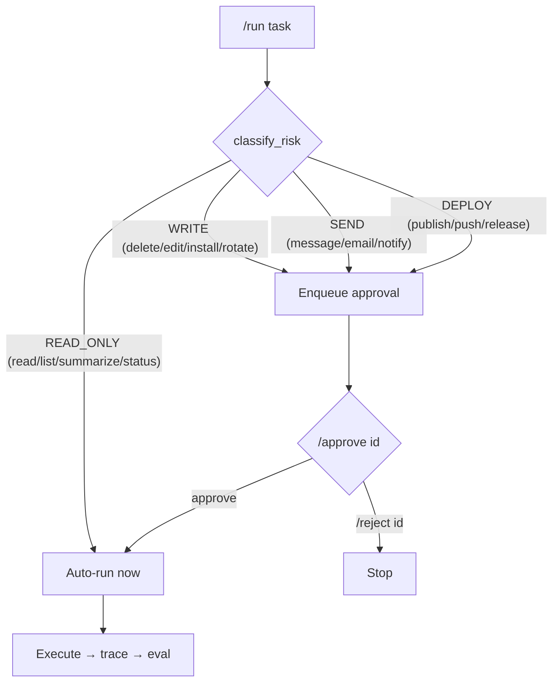
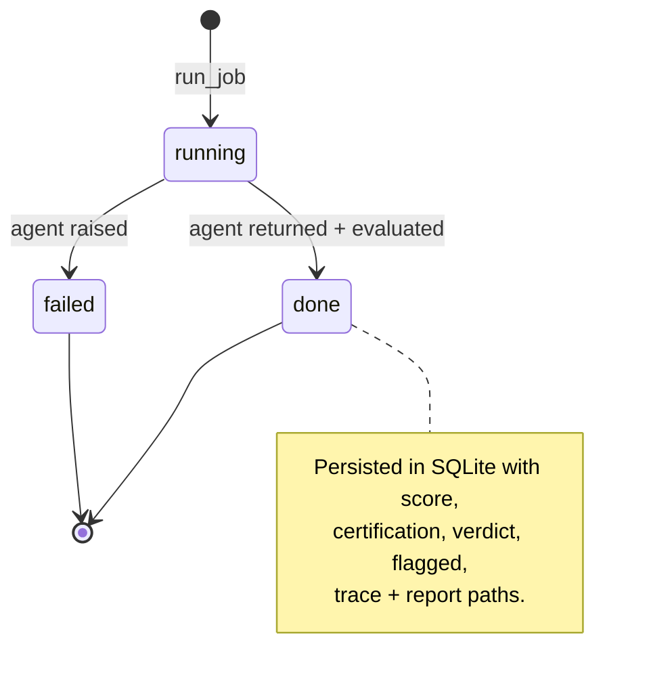
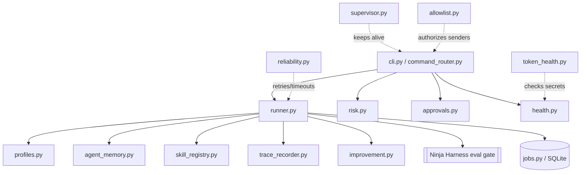
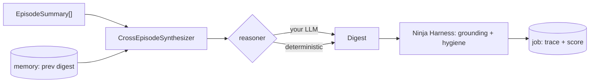

# agent-os Architecture

A visual guide to how agent-os works. (Diagrams render on GitHub.)

agent-os is the **runtime** that wraps your agents; [Ninja Harness](https://github.com/gagans23/ninja-harness)
is the **evaluation gate** it calls after every run. One runs agents, the other
grades them — kept deliberately separate.

---

## 1. The end-to-end pipeline

Every command flows through the same path: authorize → route → classify risk →
(auto-run or wait for approval) → execute with tracing → evaluate → propose
improvement → report.

---

## 2. The three levels

```mermaid
flowchart LR
    subgraph L1["Level 1 — Core (measurable)"]
        a1[SQLite jobs]
        a2[trace recorder]
        a3[skill registry]
        a4[agent profiles]
        a5["command router /eval /skills /agents /job /trace"]
    end
    subgraph L2["Level 2 — Reliability (dependable)"]
        b1[process supervisor]
        b2[health checks]
        b3[structured logs]
        b4[retries + timeouts]
        b5[token health]
        b6[sender allowlist]
        b7[daily eval]
    end
    subgraph L3["Level 3 — Controlled autonomy (powerful + safe)"]
        c1[risk classifier]
        c2["approvals /approve /reject"]
        c3[read-only auto-run]
        c4[write/send/deploy gated]
    end
    L1 --> L2 --> L3
```

---

## 3. Risk gate (controlled autonomy)

Read-only tasks run automatically. Anything that writes, sends, or deploys is
held for explicit human approval — the agent never takes a privileged action on
its own.

---

## 4. Job lifecycle

A write/send/deploy task adds an approval step first: `pending → approved →`
(then a job runs) or `pending → rejected` (no job).

---

## 5. Module map

---

## Cross-episode insight synthesis

A reasoning *skill* layered on the spine: per-source summaries → structured
insights (claim → evidence → implication → delta-vs-previous) → scored by Ninja
Harness, with the LLM pluggable. Deep dive: [`docs/insights.md`](insights.md).

`/digest` runs this as a first-class job (trace, score, memory delta, proposal).
Fetching paid providers is a cost action → routed through the `/approve` gate.

## What stays pluggable (never faked)

The live transports and external actions are adapters **you** wire with your own
credentials — agent-os ships the code, risk gating, and approval flow, but does
not call these APIs for you:

- WhatsApp / Meta Cloud API (the command transport)
- Gmail (the digest source)
- Cloudflare named tunnel (the public endpoint)
- GitHub publish (uses your `gh`/git credentials)

See [`deploy/`](../deploy/) for the tunnel config, supervisor service, allowlist,
and daily-eval schedule templates.
