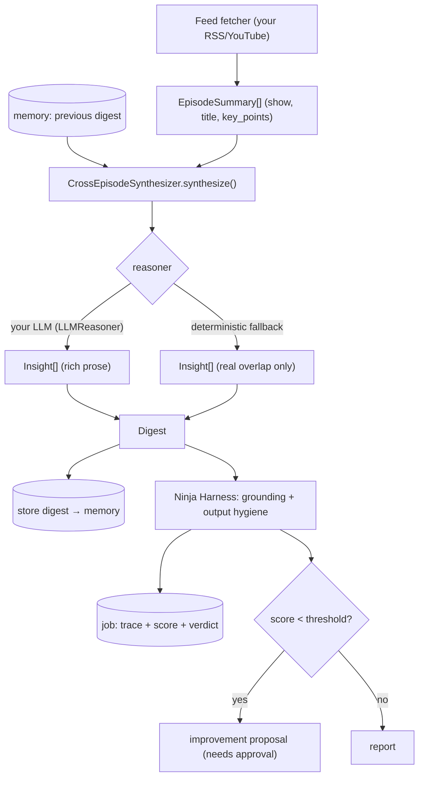
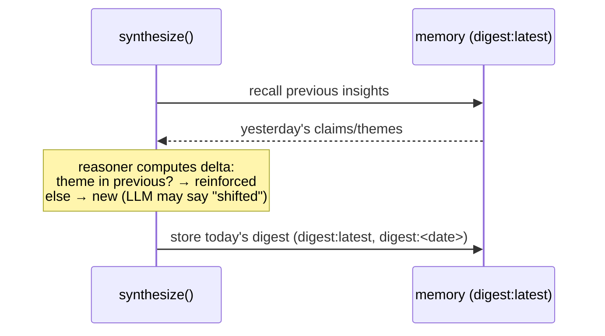

# Cross-Episode Insight Synthesis — a deep dive

How agent-os turns raw summaries into *structured, evidence-grounded, compounding
insights* — the kind of "thoughts" you see in a good cross-episode digest (claim →
evidence → implication → **delta vs the previous run**) — and how it keeps them
honest by **scoring every digest** with Ninja Harness.

This document explains the *why* as much as the *how*. (Diagrams render on GitHub.)

---

## 1. The core idea: a "thought" is an evaluated reasoning artifact

A naive digest agent prompts a model with "summarize these episodes and give me
insights." That produces fluent text — and quietly drifts: claims with no source,
the same observations every day, no way to tell good output from bad.

agent-os treats an insight as a **structured artifact you can verify and track**,
built from four parts:

| Field | What it is | Why it matters |
|---|---|---|
| **claim** | The theme / thesis | The thought itself |
| **evidence** | Quotes/points, each naming its source | Makes the claim *checkable*, not hallucinated |
| **implication** | "So what?" for a chosen lens (e.g. founder/investor) | Turns observation into a decision input |
| **delta** | How this relates to the *previous* run (new / reinforced / shifted) | Turns a daily digest into a **trend** — the compounding |

That structure is what lets the rest of the system work: evidence enables
**grounding checks**, and the delta enables **memory-based compounding**.

```python
@dataclass
class Insight:
    title: str
    claim: str
    evidence: list[str]     # each cites its source show
    implication: str
    delta: str              # vs the previous digest
    sources: list[str]
```

---

## 2. The pipeline



The synthesizer is the orchestrator; the **reasoner** is the swappable brain; the
**memory** supplies yesterday for the delta; **Ninja Harness** grades the result.

---

## 3. Grounding: every claim cites its source

The single most important design choice is that **evidence carries its source**.
Each evidence string looks like `"Acquired: Vanguard is owned by its customers"`.
That does two things:

1. A reader (or auditor) can trace any claim back to the episode.
2. Ninja Harness can **score grounding**: `Digest.as_trace_inputs()` returns the
   rendered digest as the "answer" and the episodes' key points as **references**,
   so the grounding metric measures whether the claims are actually supported by
   the source material. A digest full of unsupported assertions scores low and
   gets flagged — automatically.

```python
final_output, references = digest.as_trace_inputs()
# → Ninja Harness grounding: are the claims entailed by the references?
```

This is why the deterministic fallback only restates **real overlap** across shows
and never invents — and why a weak synthesis (low grounding) shows up as `WARN`.

---

## 4. The compounding loop: delta vs the previous run

The "delta vs previous state" is not magic — it's *yesterday's insights, loaded
from memory, compared with today's*.



Demonstrated by `examples/multiday_digest_demo.py`:

```
Day 1:  'incentives' → New        'durable' → New
Day 2:  'durable'    → Reinforced 'pricing' → New
```

Repeated themes resurface as **reinforced**; fresh ones are **new**. Over a week
this becomes a trend line, not a pile of disconnected summaries. (The richer
"reinforced *and shifted* — the lens moved from X to Y" phrasing is the LLM
reasoner's job; the deterministic fallback does the new/reinforced classification.)

---

## 5. The reasoner adapter: plug in your model

A reasoner has one signature:

```python
Reasoner = Callable[[list[EpisodeSummary], list[Insight]], list[Insight]]
```

- **`keyword_reasoner`** (default) — deterministic; surfaces themes shared across
  ≥2 shows, cites the points, classifies the delta. Honest but shallow. Good for
  tests, demos, and a zero-cost baseline.
- **`LLMReasoner(complete=...)`** — for the rich prose. **You** supply
  `complete(prompt: str) -> str` (your Anthropic/OpenAI/local client). The adapter:
  1. builds a **grounding-aware prompt** (the JSON schema + "every claim must cite
     its source" + the previous insights for the delta + the lens), and
  2. parses the model's JSON reply into `Insight` objects (tolerant of code fences).

```python
from agent_os.reasoners import LLMReasoner
from agent_os.insights import CrossEpisodeSynthesizer

def complete(prompt: str) -> str:
    return my_model.generate(prompt)          # ← your model. Nothing bundled.

synth = CrossEpisodeSynthesizer(reasoner=LLMReasoner(complete), memory=mem)
digest = synth.synthesize(episodes, lens="founder/investor")
```

The prompt the adapter sends (abbreviated) makes the contract explicit:

```
You synthesize cross-episode insights ...
- EVERY claim must be supported by `evidence`, each naming its source show.
- `delta`: new / reinforced / shifted vs the PREVIOUS insights below.
- `implication` for this lens: {lens}
Return ONLY a JSON array: {title, claim, evidence[], implication, delta, sources[]}
PREVIOUS INSIGHTS: ...
EPISODES: ...
```

Because the model is injected, agent-os makes **no network call** and bundles no
keys — you own the model, the cost, and the data path.

---

## 6. How it lives in the platform

`/digest` makes synthesis a first-class job, so insights flow through the same
spine as everything else:

- **Feed fetcher** → `digest_source` (you supply; a demo set ships).
- **Reasoner** → `reasoner` (your LLM; deterministic fallback by default).
- The digest runs through `run_job`, so it gets a **trace** (`/trace <id>`), a
  **Ninja score**, a persisted **job** (`/job <id>`), a **memory delta**, and — if
  weak — an **improvement proposal** (propose-only, needs approval).
- **Cost guard:** fetching *paid* providers is a cost action. The skill marks it
  so it routes through the Level 3 **risk gate** (`/approve`) rather than running
  silently. The screenshot's "No paid providers were invoked" is exactly this
  posture, made enforceable.

```bash
agent-os cmd "/digest"        # synthesize → score → persist → report
agent-os cmd "/trace <id>"    # inspect the digest's trajectory + grounding
```

---

## 7. Pitfalls & anti-patterns (what *not* to do)

- **Don't let claims float.** Every claim needs evidence with a source, or
  grounding (and trust) collapse.
- **Don't auto-invoke paid providers.** Route cost actions through approval.
- **Don't dump transcripts** into the final answer — output hygiene will (rightly)
  tank. Put raw material in artifacts; keep the digest concise.
- **Don't overstate the delta.** Only call something "shifted" if the prior digest
  genuinely differs; otherwise it's noise dressed as insight.
- **Don't skip the score.** An unevaluated digest can't improve. The whole point
  is that quality is measured and compounds.

---

## 8. Worked example

`examples/podcast_digest_demo.py` (Acquired *Vanguard* + Huberman *Epley*):

```
Cross-episode insights
1) Shared theme: 'incentives'
- Claim/theme: Acquired and Huberman Lab both touch on 'incentives'.
- Evidence: Acquired: ...aligning incentives with investors; Huberman Lab: ...updating incentives and feedback
- Implication (founder/investor): (supply an LLM reasoner for a tailored implication)
- Delta vs previous: New theme vs previous digest.

[Ninja Harness] grounding=0.44  hygiene=0.94  cert=WARN
```

The `WARN` is the system *working*: the deterministic fallback's phrasing isn't
richly tied to evidence, so it's flagged. Swap in `LLMReasoner` and the claim,
evidence, and implication become specific — grounding rises and it certifies PASS.

---

## 9. API reference

| Symbol | Module | Purpose |
|---|---|---|
| `EpisodeSummary` | `agent_os.insights` | Input: one episode (show, title, key_points, is_paid) |
| `Insight` | `agent_os.insights` | Output unit: claim/evidence/implication/delta/sources |
| `Digest` | `agent_os.insights` | A day's episodes + insights; `.render()`, `.as_trace_inputs()` |
| `CrossEpisodeSynthesizer` | `agent_os.insights` | Orchestrates reasoner + memory delta |
| `keyword_reasoner` | `agent_os.insights` | Deterministic fallback reasoner |
| `LLMReasoner` | `agent_os.reasoners` | Adapter for your model (`complete=`) |
| `/digest` | `agent_os.command_router` | Run + score + persist a digest from the command surface |

See also: [`docs/architecture.md`](architecture.md) for how this fits the whole platform.
